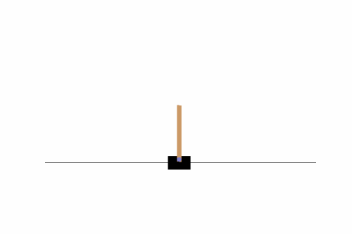

# Deep Q-Learning

## Recommend papers

The first step is to read and understand the method that you will implement. It was first introduced in [a 2013 paper ](https://arxiv.org/abs/1312.5602) and further improved and elaborated upon in the [Nature DQN paper](https://web.stanford.edu/class/psych209/Readings/MnihEtAlHassibis15NatureControlDeepRL.pdf) in 2015. We suggest reading both. In your final report, we want you to briefly describe how the Deep Q-learning method works and discuss the new ideas that makes the algorithm work.

## Environment

We will use [OpenAI gyms Atari-environments](https://gym.openai.com/envs/#atari). To test that your installation include these you can use

```
import gym
env = gym.make('Pong-v0')
```

If this does not work, you can install it with 

```bash
pip install gym[atari]
```

## Implement and test DQN

DQN can be tricky to implement because it's difficult to debug and sensitive to the choice of hyperparameters. For this reason, it is advisable to start testing on a simple environment where it is clear if it works within minutes rather than hours.

You will be implementing DQN to solve [CartPole](https://gym.openai.com/envs/CartPole-v0/).

<div align="center">

</div>


For different reward functions, the convergence of models at different speeds varies greatly. We have customized a function, when the angle of the joystick is closer to 90 degrees and the position of the trolley is closer to the center of mass, the reward is higher, the covergece speed is higher than we simple define the reward as -1 when the situation done.

## Learn to play Pong

### **Preprocessing frames**

A convenient way to deal with preprocessing is to wrap the environment with `AtariPreprocessing` from `gym.wrappers` as follows:

```
env = AtariPreprocessing(env, screen_size=84, grayscale_obs=True, frame_skip=1, noop_max=30)
```

You should also rescale the observations from 0-255 to 0-1.

### **Stacking observations**

The current frame doesn't provide any information about the velocity of the ball, so DQN takes multiple frames as input. At the start of each episode, you can initialize a frame stack tensor

```
obs_stack = torch.cat(obs_stack_size * [obs]).unsqueeze(0).to(device)
```

When you receive a new observation, you can update the frame stack with and store it in the replay buffer as usual.

```
next_obs_stack = torch.cat((obs_stack[:, 1:, ...], obs.unsqueeze(1)), dim=1).to(device)
```

### **Policy network architecture**

We recommend using the convolutional neural network (CNN) architecture described in the [Nature DQN paper (Links to an external site.)](https://web.stanford.edu/class/psych209/Readings/MnihEtAlHassibis15NatureControlDeepRL.pdf). The layers can be initialized with

```
self.conv1 = nn.Conv2d(4, 32, kernel_size=8, stride=4, padding=0)
self.conv2 = nn.Conv2d(32, 64, kernel_size=4, stride=2, padding=0)
self.conv3 = nn.Conv2d(64, 64, kernel_size=3, stride=1, padding=0)
self.fc1 = nn.Linear(3136, 512)
self.fc2 = nn.Linear(512, self.n_actions)
```

and we use ReLU activation functions as previously. `nn.Flatten()` may be helpful to flatten the outputs before the fully-connected layers.

### **Hyperparameters**

We suggest starting with the following hyperparameters:

> Observation stack size: 4
> Replay memory capacity: 10000
> Batch size: 32
> Target update frequency: 1000
> Training frequency: 4
> Discount factor: 0.99
> Learning rate: 1e-4
> Initial epsilon: 1.0
> Final epsilon: 0.01
> Anneal length: 10**6

While these should work, they are not optimal and you may play around with hyperparameters if you want.


