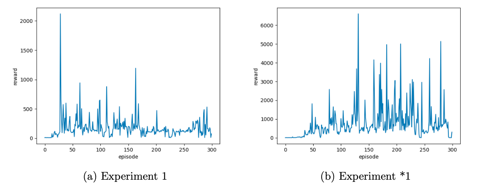
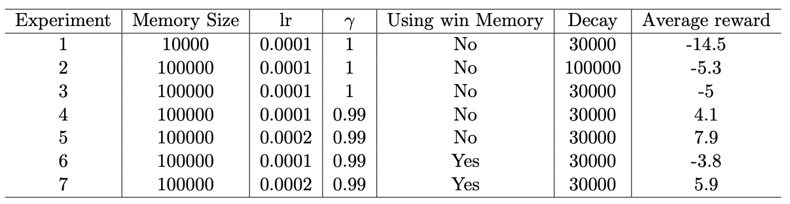

# Deep Q-Learning

## Recommend papers

The first step is to read and understand the method that you will implement. It was first introduced in [a 2013 paper ](https://arxiv.org/abs/1312.5602) and further improved and elaborated upon in the [Nature DQN paper](https://web.stanford.edu/class/psych209/Readings/MnihEtAlHassibis15NatureControlDeepRL.pdf) in 2015. We suggest reading both. In your final report, we want you to briefly describe how the Deep Q-learning method works and discuss the new ideas that makes the algorithm work.

## Environment

We will use [OpenAI gyms Atari-environments](https://gym.openai.com/envs/#atari). To test that your installation include these you can use

```
import gym
env = gym.make('Pong-v0')
```

If this does not work, you can install it with 

```bash
pip install gym[atari]
```

## Implement and test DQN

DQN can be tricky to implement because it's difficult to debug and sensitive to the choice of hyperparameters. For this reason, it is advisable to start testing on a simple environment where it is clear if it works within minutes rather than hours.

You will be implementing DQN to solve [CartPole](https://gym.openai.com/envs/CartPole-v0/).

<div align="center">

</div>

For different reward functions, the convergence of models at different speeds varies greatly. We have customized a function, when the angle of the joystick is closer to 90 degrees and the position of the trolley is closer to the center of mass, the reward is higher, the covergece speed is higher than we simple define the reward as -1 when the situation done.



As you can see in experiment 1 and *1, the hyperparameters are the same but with different reward functions. In experiment 1, the reward function is simple, the agent gets reward 1 when the game was not done, otherwise, the reward is -1. But in experiment *1, we changed the reward function which is based on the state. When the car is closer to the midpoint, the reward is higher. When the angle between the flag and the horizontal line is closer to 90 degrees, the reward is higher, and vice versa. The results revealed that a good reward function can make a huge difference in performance when it comes to Reinforcement Learning, which can speed up the process of agent learning.

## Learn to play Pong

### **Preprocessing frames**

A convenient way to deal with preprocessing is to wrap the environment with `AtariPreprocessing` from `gym.wrappers` as follows:

```
env = AtariPreprocessing(env, screen_size=84, grayscale_obs=True, frame_skip=1, noop_max=30)
```

You should also rescale the observations from 0-255 to 0-1.

### **Stacking observations**

The current frame doesn't provide any information about the velocity of the ball, so DQN takes multiple frames as input. At the start of each episode, you can initialize a frame stack tensor

```
obs_stack = torch.cat(obs_stack_size * [obs]).unsqueeze(0).to(device)
```

When you receive a new observation, you can update the frame stack with and store it in the replay buffer as usual.

```
next_obs_stack = torch.cat((obs_stack[:, 1:, ...], obs.unsqueeze(1)), dim=1).to(device)
```

### **Policy network architecture**

We recommend using the convolutional neural network (CNN) architecture described in the [Nature DQN paper (Links to an external site.)](https://web.stanford.edu/class/psych209/Readings/MnihEtAlHassibis15NatureControlDeepRL.pdf). The layers can be initialized with

```
self.conv1 = nn.Conv2d(4, 32, kernel_size=8, stride=4, padding=0)
self.conv2 = nn.Conv2d(32, 64, kernel_size=4, stride=2, padding=0)
self.conv3 = nn.Conv2d(64, 64, kernel_size=3, stride=1, padding=0)
self.fc1 = nn.Linear(3136, 512)
self.fc2 = nn.Linear(512, self.n_actions)
```

and we use ReLU activation functions as previously. `nn.Flatten()` may be helpful to flatten the outputs before the fully-connected layers.

### **Hyperparameters**

We suggest starting with the following hyperparameters:

> Observation stack size: 4
> Replay memory capacity: 10000
> Batch size: 32
> Target update frequency: 1000
> Training frequency: 4
> Discount factor: 0.99
> Learning rate: 1e-4
> Initial epsilon: 1.0
> Final epsilon: 0.01
> Anneal length: 10**6

While these should work, they are not optimal and you may play around with hyperparameters if you want.


## Results of Pong

**Note: The more detail analysis can be viewed in analysis folder.**

All the experiments are implemented in Google Colab with 2.5 million frames. The parameters are explained as follows.



### Discussion

The curve in the resulting figures may not be a good description of the performance of the current model, because we take the average of the most recent 10 episodes as the score of the current model. So when the experiment is over, we re-evaluated the average value ten times with the saved model. This result will be more representative.

We implement multiple experiments based on the environment Pong-v0. In general, the results are basically satisfactory. The configuration of the model and its performance(Column Average reward) are displayed as Table 2.

#### Replay Memory Size

Figure 3 visualizes the results of Experiment 1, 2 and 3. It can be observed from 3a that when the replay memory size is 10000, the performance of the model is unstable, comparing with the averaged reward trend in Experiment 3. The reason for the differences is that the larger the experience replay, the less likely you will sample correlated elements, hence the more stable the training of the NN will be. However, a large experience replay requires a lot of memory so the training process is slower. Therefore, there is a trade-off between training stability (of the NN) and memory requirements. In these three experiments, the gamma valued 1, so the model is unbiased but with high variance, and also we have done the Experiment 2 twice, second time is basically satisfactory (as you can see in the graph), but first Experiment 2 were really poor which is almost same with Experiment 3. The result varies a lot among these two experiment due to the gamma equals to 1.

#### Learning Rate

Now we discuss how learning rate affects the averaged reward. It is found from Figure 4 that a high learning rate has relatively large volatility on the overall curve, and the learning ability is not stable enough, but the learning ability will be stronger.

#### Win Replay Memory

Here we try a new way to train our model and create a win replay memory for those frames that our agent gets reward 1. After 0.4 million frames, we start to randomly pick 5 samples from this win memory and then train the model every 5 thousand frames. The idea is for this kind of memory, the loss may vary a lot, so the model will tune the parameters more. But the results show that the performance is basically the same or even worse than that of learning rate = 0.0002.

### Summary

Each experiment takes 4h on Google Colab. We achieve 10-time average reward of 7.9 as the best result that is better than Experiment 1(suggested configuration on Studium), although the result is somewhat random and may be unreproducible. It seems that the models with higher learning rate(0.002) perform better, but its reward influtuates more sharply.


